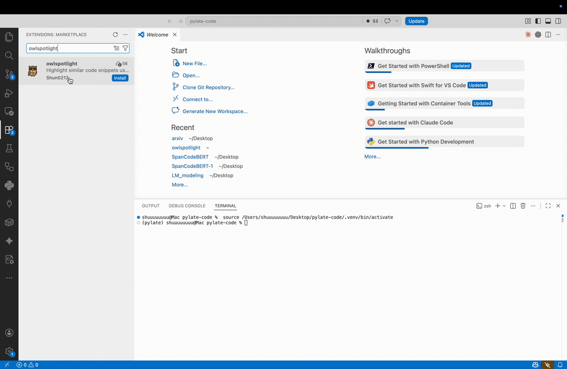
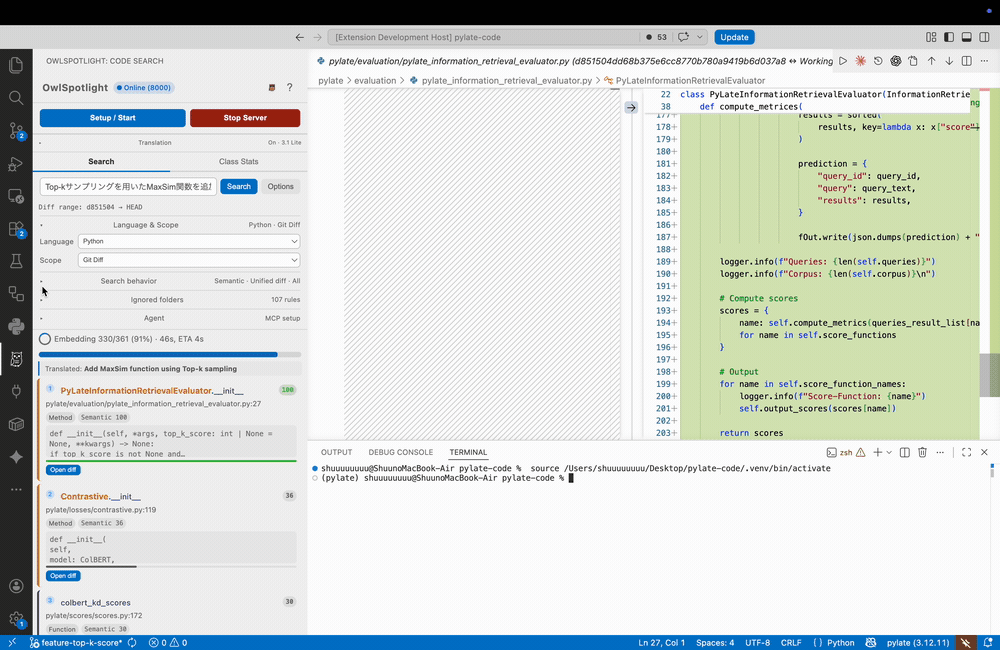

# OwlSpotlight Demo

[English](#english) | [日本語](#japanese)

These short clips show OwlSpotlight in action inside VS Code: starting the local
search server, searching a real codebase with natural language and jumping
straight to the highlighted definition, and scoping a semantic search to a Git
diff. The search clips were recorded on the [PyLate](https://github.com/lightonai/pylate)
codebase.

---

## English

### 1. Startup — install and start the server

Open the OwlSpotlight sidebar and click **Setup / Start**. The `uv`-managed
Python environment is set up, then the background FastAPI server boots on
`127.0.0.1` and is ready to use. Server logs stream into
**Output → OwlSpotlight**. Everything runs locally; your code never leaves your
machine.

### 2. Search — natural language to highlighted code

Type what the code *does* in the search bar (English or Japanese). OwlSpotlight
returns the matching functions, methods, classes, and CodeBlocks in the sidebar,
then jumps to the file and highlights the definition.

In the clip, several natural-language queries (English and Japanese) each surface
a different, relevant set and jump to the highlighted definition: **“reorder
documents by relevance”** → `rerank` / `ColBERT.retrieve`, **“reorder search
results by relevance”** → `ColBERT.retrieve`, **“sort by relevance using
MaxSim”** → `colbert_kd_scores` / `CoLBERT.similarity_by_name`, and **“rank by
relevance using top-k sampling”** → `ScaNN.retrieve` / `FastPlaid.retrieve`.

Example queries that work well on this codebase:

| Language | Query |
|---|---|
| English | `find the nearest documents to a query` |
| English | `reorder search results by relevance` |
| 日本語 | `クエリに一番近い文書を探す` |
| 日本語 | `検索結果を関連度で並べ替える` |

### 3. Git Diff search — search only what changed

Set **Scope → Git Diff**, pick the base/head commits from the built-in commit
graph (click for base, Shift+Click for head), and choose a **Diff view**
(`Functions` or `Unified diff`). The semantic search now runs only over the diff.

In the clip, the query **“keep only the top-k token scores when aggregating
maxsim”** pulls the `top_k_score` change out of a diff scattered across many
files, landing on `colbert_scores`, `colbert_kd_scores`, and
`colbert_scores_pairwise`. With **Diff view → Unified diff**, the matched
changes open as side-by-side hunks (the green `top_k_score` additions across
`scores.py`, `rerank`, the evaluators, …) — so you review exactly the changed
lines that match your intent instead of scrolling a raw `git diff`.

| Language | Query |
|---|---|
| English | `keep only the top-k token scores when aggregating maxsim` |
| 日本語 | `上位k件のスコアだけ残してMaxSimを集計する` |

> The clips are sped up for brevity. Actual indexing time depends on repository
> size and whether you run on CPU / GPU / MPS.

---

## 日本語

### 1. 起動 — インストールしてサーバーを起動する

OwlSpotlight のサイドバーを開き、**Setup / Start** をクリックします。
`uv` 管理の Python 環境がセットアップされ、続いてバックグラウンドの
FastAPI サーバーが `127.0.0.1` で起動し、使用できる状態になります。
サーバーのログは **表示 → 出力 → OwlSpotlight** に表示されます。
すべてローカルで動くため、コードが外部に送信されることはありません。

### 2. 検索 — 自然言語からハイライト表示へ

検索バーに「そのコードが何をするものか」を自然言語（日本語・英語）で
入力します。OwlSpotlight が該当する関数・メソッド・クラス・CodeBlock を
サイドバーに一覧表示し、その場所へジャンプして定義をハイライト表示します。

クリップでは、複数の自然言語クエリ（英語・日本語）を順に試し、それぞれ
異なる関連結果へジャンプ＆ハイライトしています。「reorder documents by
relevance」→ `rerank` / `ColBERT.retrieve`、「検索結果を関連度で並べ替える」→
`ColBERT.retrieve`、「MaxSimを使って関連度で計算する」→ `colbert_kd_scores` /
`CoLBERT.similarity_by_name`、「Top-kサンプリングを使って関連度で並べ替える」→
`ScaNN.retrieve` / `FastPlaid.retrieve`。

このコードベースでよく効くクエリ例：

| 言語 | クエリ |
|---|---|
| 英語 | `find the nearest documents to a query` |
| 英語 | `reorder search results by relevance` |
| 日本語 | `クエリに一番近い文書を探す` |
| 日本語 | `検索結果を関連度で並べ替える` |

### 3. Git Diff 検索 — 変更箇所だけを検索する

**Scope → Git Diff** を選び、内蔵のコミットグラフから base / head を選択し
（クリックで base、Shift+クリックで head）、**Diff view**（`Functions` か
`Unified diff`）を選びます。これでセマンティック検索が差分の範囲だけに
限定されます。

クリップでは **「keep only the top-k token scores when aggregating maxsim」**
というクエリで、多数のファイルに散らばった `top_k_score` の変更を拾い出し、
`colbert_scores` / `colbert_kd_scores` / `colbert_scores_pairwise` という
変更済み関数を抽出しています。**Diff view → Unified diff** にすると、
一致した変更箇所が差分（`scores.py` / `rerank` / 評価まわりに散らばった
緑色の `top_k_score` 追加行）として並んで開くので、生の `git diff` を
目で追わずに、意図に合致した変更行だけを確認できます。

| 言語 | クエリ |
|---|---|
| 英語 | `keep only the top-k token scores when aggregating maxsim` |
| 日本語 | `上位k件のスコアだけ残してMaxSimを集計する` |

> クリップは説明のため早送りしています。実際のインデックス作成時間は
> リポジトリの規模や、CPU / GPU / MPS のどれで実行するかによって変わります。
