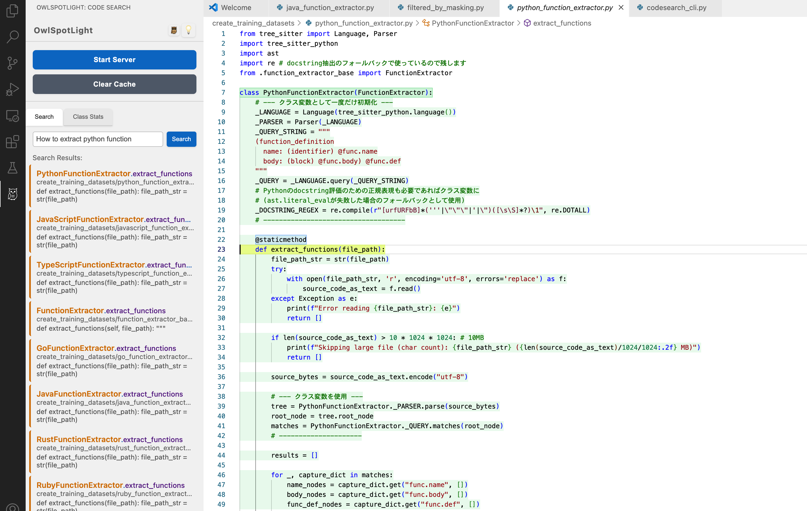
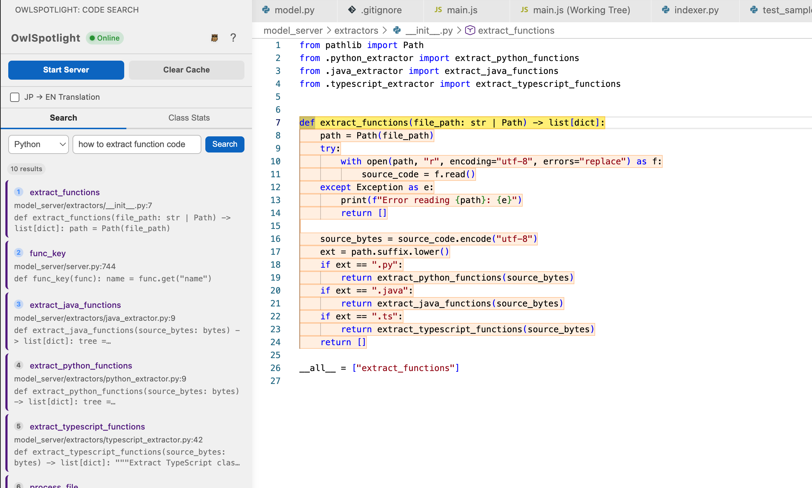
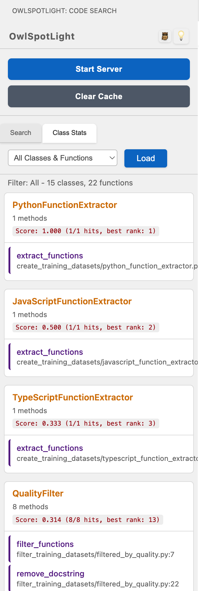
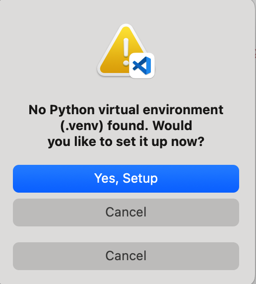
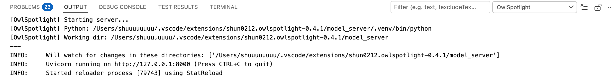
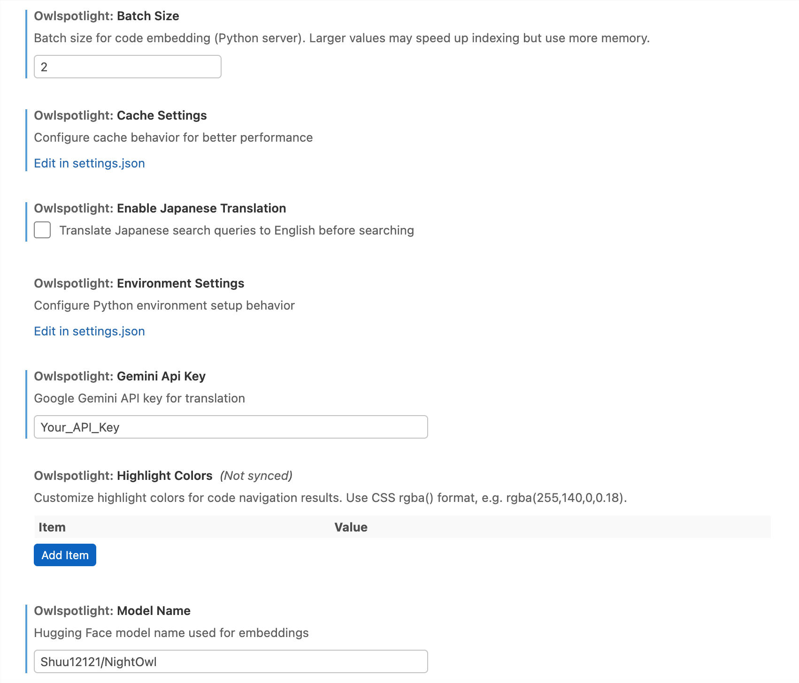

<!-- ✨✨✨ モデルを大幅アップデートしました！新しいAIモデルでより高精度な検索が可能になりました ✨✨✨ -->
# 🦉 OwlSpotlight

<div align="center">

[](https://opensource.org/licenses/MIT)
[](https://github.com/shun0212/OwlSpotLight)
[](https://www.python.org/)
[](https://code.visualstudio.com/)

**🔍 Instantly discover code with AI-powered semantic search**

*A powerful VS Code extension that revolutionizes how you navigate Python codebases using natural language queries*

[English](#english) | [日本語](#japanese)

</div>

---

## English

### 🚀 What is OwlSpotlight?

OwlSpotlight transforms code navigation by bringing **semantic understanding** to your VS Code workspace. Instead of searching for exact matches, ask questions like *"function that validates email"* or *"class for handling database connections"* and instantly find relevant code across your entire Python project.



**Instantly discover code with semantic search. A VS Code extension for searching Python functions, classes, and methods using natural language.**

**意味的検索でPython関数・クラス・メソッドを瞬時に発見できるVS Code拡張機能。**

---

### Key Features

- AI-powered semantic search – Find code by intent, not just keywords
- Fast search and incremental indexing
- Search functions, classes, methods, and their relationships
- Results ranked by relevance
- Only changed files are re-indexed
- Simple, intuitive sidebar interface
- Apple Silicon optimized
- CUDA/GPU acceleration supported
- Built-in cache clearing and environment management
- Customizable SentenceTransformer model via settings

### See It In Action

| Feature | Description | Preview |
|---------|-------------|---------|
| **🔍 Semantic Function Search** | Find functions by describing what they do in natural language |  |
| **🏗️ Class & Method Discovery** | Explore class hierarchies and their methods with context-aware search |  |
| **📊 Intelligent Ranking** | View classes ranked by relevance with detailed statistics. Methods inside each class are ordered by their search rank so you can see which ones boosted the score. |  |
| **⚙️ Environment Management** | Built-in alerts and management for Python environments |  |

### 🚀 Quick Start

**Prerequisites**: Python 3.9+ installed on your system

> **Note:** Queries can be entered in English or Japanese. Japanese text will be automatically translated to English when the feature is enabled in the settings.

#### Option 1: Automatic Setup (Recommended for macOS/Linux)

1. **Open this project** in VS Code
2. **Setup environment** - Open Command Palette (`Cmd+Shift+P`) and run:
   ```
   OwlSpotlight: Setup Python Environment
   ```
3. **Start the server**:
   ```
   OwlSpotlight: Start Server
   ```
4. **Start searching!** Open the OwlSpotlight sidebar and enter your query



#### Option 2: Manual Installation

1. **Build the extension**:
   ```bash
   npm install
   npm run compile
   npx vsce package
   ```

2. **Install in VS Code**:
   - Open Command Palette (`Cmd+Shift+P`)
   - Select `Extensions: Install from VSIX...`
   - Choose the generated `.vsix` file

3. **Setup Python environment**:
   ```bash
   cd model_server
   python3 -m venv .venv
   source .venv/bin/activate  # On Windows: .venv\Scripts\activate
   pip install -r requirements.txt
   ```

4. **Launch**: Run the commands from Option 1, steps 2-4

### 💡 Why OwlSpotlight?

| Traditional Search | OwlSpotlight |
|-------------------|--------------|
| `def email_validation` | *"function that validates email addresses"* |
| `class Database` | *"class for database connections"* |
| Exact keyword matching | Semantic understanding of code purpose |
| Limited to function names | Searches documentation, comments, and logic |

### ⚙️ System Requirements

| Component | Requirement | Notes |
|-----------|-------------|-------|
| **Python** | 3.9+ (3.11 recommended) | Virtual environment recommended |
| **Memory** | 4GB+ (8GB+ for large projects) | More RAM = better performance |
| **Storage** | 2-3GB | For dependencies and models |
| **Platform** | macOS (optimized), Linux, Windows | Apple Silicon fully supported |

### 🛠️ Advanced Configuration

#### macOS/Linux

```bash
# Install dependencies (requires Homebrew)
brew install npm pyenv
pyenv install 3.11

cd model_server
pyenv local 3.11
python3 -m venv .venv
source .venv/bin/activate
pip install -r requirements.txt
```

#### Windows

```powershell
# Install Python 3.11 from https://www.python.org/downloads/
# (optional) pyenv-win can be used to manage multiple versions

cd model_server
py -3.11 -m venv .venv    # or 'python -m venv .venv' if Python 3.11 is default
\.venv\Scripts\Activate.ps1   # For CMD use .venv\Scripts\activate
pip install -r requirements.txt
```

You can change the embedding model by modifying the `owlspotlight.modelSettings.modelName` setting in VS Code. By default it uses `Shuu12121/CodeSearch-ModernBERT-Owl-2.0-Plus`.

Japanese queries can be translated automatically by enabling `owlspotlight.translationSettings.enableJapaneseTranslation`.

Progress bars during embedding can be disabled by setting the environment variable `OWL_PROGRESS=0`.

**Performance Tips**:
- Use SSD storage for faster indexing
- Allocate more RAM for large projects
- Exclude unnecessary files via `.gitignore`
- Consider `flash-attn` for CUDA environments

### 🚧 Development Roadmap

#### ✅ Current Features
- [x] Natural language search for Python functions/classes/methods
- [x] Real-time incremental indexing
- [x] Apple Silicon optimization
- [x] Class relationship visualization
- [x] Advanced filtering and statistics
- [x] Experimental Java support
- [x] Experimental TypeScript support (.ts)
- [x] Automatic language detection with selectable options
- [x] Optional Japanese to English translation for search queries

#### 🔄 Coming Soon
- [ ] **Multi-language support** (JavaScript, Java)
- [ ] **VS Code Marketplace** release
- [ ] **Real-time file watching** (auto-update on save)
- [ ] **Class inheritance diagrams**

### 🤝 Contributing

We welcome contributions! Here's how you can help:

- 🐛 **Report bugs** in [Issues](https://github.com/shun0212/OwlSpotLight/issues)
- 💡 **Suggest features** via GitHub Issues
- 🔧 **Submit pull requests** for improvements
- 📖 **Improve documentation**

### 📄 License

MIT License - see [LICENSE](LICENSE) file for details.

---

## Japanese

### OwlSpotlightとは？

OwlSpotlightは、VS CodeでPythonコードを自然言語で検索できる拡張機能です。
現在[Visual Studio Code Marketplace](https://marketplace.visualstudio.com/items?itemName=Shun0212.owlspotlight)でも公開・配布しています。
従来のキーワード検索とは異なり、「メールを検証する関数」や「データベース接続を処理するクラス」など、意図を表現したクエリで関連するコードを素早く見つけることができます。

### 主な特長

- 自然言語によるコード検索
- 高速な検索とインデックス更新
- 関数・クラス・メソッドの検索
- 関連度に基づくランキング
- 変更ファイルのみ再インデックス
- シンプルで使いやすいUI
- Apple Silicon対応
- CUDA/GPU　対応
- サイドバーから環境管理やキャッシュクリアが可能

### クイックスタート

**前提条件**: システムにPython 3.9+がインストールされていること

> **注意:** クエリは英語または日本語で入力できます。設定で自動翻訳を有効にすると、日本語クエリは英語に変換されて検索されます。

#### 方法1: 自動セットアップ（macOS/Linux推奨）

1. プロジェクトを開く - VS Codeでこのプロジェクトを開く
2. 環境セットアップ - コマンドパレット（`Cmd+Shift+P`）で実行：
   ```
   OwlSpotlight: Setup Python Environment
   ```
3. サーバー開始：
   ```
   OwlSpotlight: Start Server
   ```
4. サイドバーから検索を開始

#### 方法2: 手動インストール

1. 拡張機能をビルド：
   ```bash
   npm install
   npm run compile
   npx vsce package
   ```
2. VS Codeで「Extensions: Install from VSIX...」を選択し、生成された`.vsix`ファイルをインストール
3. Python環境をセットアップ：
   ```bash
   cd model_server
   python3.11 -m venv .venv
   source .venv/bin/activate  # Windows: .venv\Scripts\activate
   pip install -r requirements.txt
   ```

### OwlSpotlightを選ぶ理由

| 従来の検索 | OwlSpotlight |
|-----------|--------------|
| `def email_validation` | "function that validates email address" のような英語クエリや、日本語クエリを自動翻訳して検索可能 |
| `class Database` | 英語・日本語どちらの自然なクエリでも検索可能（日本語は自動翻訳） |
| キーワード完全一致が必要 | 完全一致でなくても意図が伝われば検索可能 |
| 関数名のみ対象 | コメントや処理内容も自然言語クエリで検索対象 |

### 高度な設定

#### 翻訳設定（日本語検索対応）

OwlSpotlightは日本語クエリを英語に自動翻訳して検索することができます。翻訳サービスは**Google Gemini API**のみ対応しています。

##### Gemini APIを使用した翻訳（推奨）

高精度な翻訳のためにGoogle Gemini APIを使用できます：

1. [Google AI Studio](https://aistudio.google.com/app/apikey)で無料のAPIキーを取得
2. VS Codeの設定を開く（`Cmd+,` または `Ctrl+,`）
3. 以下の設定を行う：
   - `owlspotlight.translationSettings.enableJapaneseTranslation`: `true`
   - `owlspotlight.translationSettings.geminiApiKey`: あなたのGemini APIキー
   - `owlspotlight.modelSettings.modelName`: Embedding model name (e.g. `Shuu12121/CodeSearch-ModernBERT-Owl-2.0-Plus`)



**使用例：**
- 「メールアドレスを検証する関数」→ "function that validates email address"
- 「データベース接続を管理するクラス」→ "class that manages database connection"

### 開発ロードマップ

#### 現在の機能
- Python関数・クラス・メソッドの自然言語検索
- インクリメンタルインデックス更新
- Apple Silicon対応
- クラス構造の可視化
- フィルタ・統計表示
- Java対応（実験的）
- TypeScript対応（実験的・.ts）

#### 今後の予定
- 多言語対応（JavaScript, Java, C++など）
- VS Code Marketplace公開
- ファイル保存時の自動更新
- クラス継承図の表示

### 自動テストとデプロイ

GitHub Actions を利用した CI ワークフローを追加しました。`main` ブランチへのプッシュや
プルリクエスト時に `npm test` と `eslint` を実行して拡張機能をビルドします。

タグ `v*.*.*` を作成すると、自動的に VS Code 拡張機能 (`vsix` ファイル) を生成し、
`vsce publish` を使用してマーケットプレースへ公開できます。発行用のトークンは
`VSCE_TOKEN` シークレットに設定してください。

### ライセンス

MIT License - 詳細は[LICENSE](LICENSE)をご覧ください。

---

<div align="center">

**⚡ Made with ❤️ for developers who love efficient code navigation**

[⭐ Star this project](https://github.com/shun0212/OwlSpotLight) | [🐛 Report Issues](https://github.com/shun0212/OwlSpotLight/issues) | [💬 Discussions](https://github.com/shun0212/OwlSpotLight/discussions)

</div>
