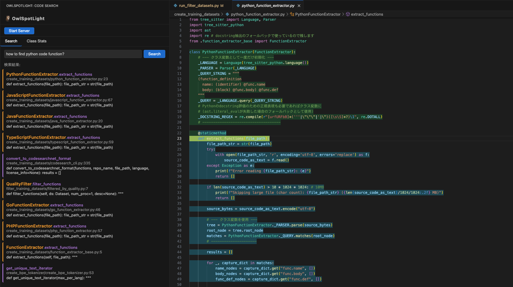
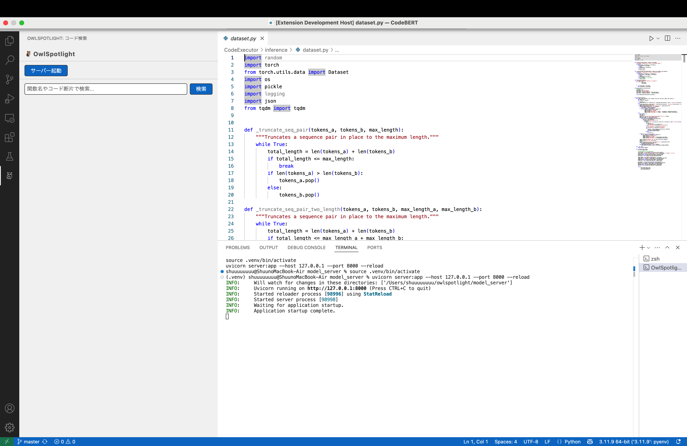
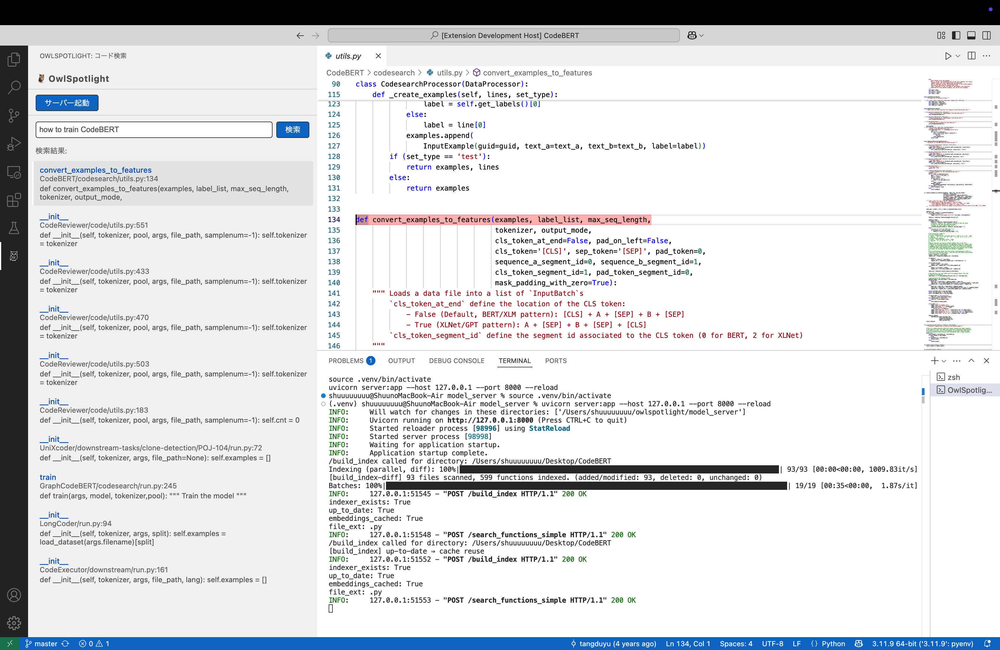
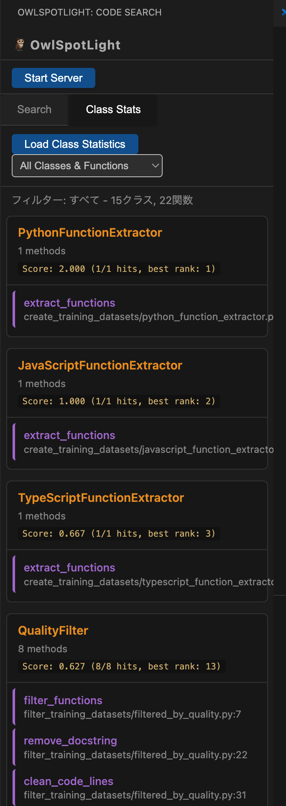
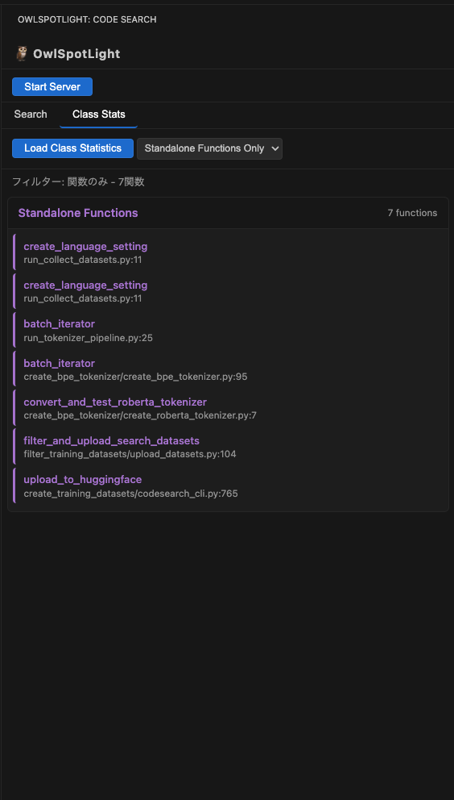

# 🦉 OwlSpotlight

**意味的検索でコードを瞬時に発見。Pythonプロジェクトの関数・クラスを自然言語で検索できるVS Code拡張機能**

_Discover code instantly with semantic search. A VS Code extension that lets you search Python functions and classes using natural language._



## ✨ 主な機能 / Key Features

- 🔍 **自然言語でコード検索** - 「データを処理する関数」のような検索が可能
- ⚡ **瞬時のジャンプ** - 検索結果から該当コードに即座に移動
- 🎯 **関数・クラス両対応** - 関数とクラスメソッドの両方を検索対象
- 📊 **クラス統計表示** - プロジェクト内のクラス構造を一覧表示
- 🚀 **高速インクリメンタル更新** - ファイル変更時も差分のみ更新
- 🎨 **直感的なUI** - サイドバーから簡単操作

---

## 🚀 クイックスタート / Quick Start

### 自動セットアップ（推奨）/ Automatic Setup (Recommended)

1. **VS Codeで本プロジェクトを開く**
2. **コマンドパレット** (`Cmd+Shift+P` / `Ctrl+Shift+P`) で以下を実行：
   ```
   OwlSpotlight: Setup Python Environment
   ```
3. **サーバー起動**：
   ```
   OwlSpotlight: Start Server
   ```
4. **サイドバーから検索開始！**



---

## 🎬 使用例 / Usage Examples

### 1. 自然言語でコード検索
自然言語による直感的な検索が可能です：



### 2. 関数・クラス統合検索
関数とクラスメソッドを一括で検索・表示：


### 3. クラス構造の可視化
プロジェクト全体のクラス構造を統計表示：



### 4. 検索結果の絞り込み
関数のみに絞った精密な検索：



---

## 💡 OwlSpotlightの特長 / Why Choose OwlSpotlight

### 🎯 高精度な意味的検索
- **自然言語クエリ対応** - 「データを処理する関数」のような検索が可能
- **コード断片検索** - 実際のコード片でも検索できる
- **関数・クラス両対応** - 関数とクラスメソッドを包括的に検索

### ⚡ パフォーマンス
- **高速インクリメンタル更新** - 変更部分のみを効率的に更新
- **クラスタ分割インデックス** - 大規模プロジェクトでも高速検索
- **FAISS最適化** - 数万関数規模でも瞬時に検索

### 🛠 開発体験
- **直感的UI** - サイドバーから簡単操作
- **即座のハイライト** - 検索結果をエディタで即座に表示
- **.gitignore準拠** - 不要ファイルを自動除外
- **Apple Silicon最適化** - M1/M2/M3/M4チップで高速動作

### 🔄 スマートな更新
- **差分検出** - ファイルの追加・変更・削除を自動検知
- **関数レベル管理** - 関数単位での精密なインデックス管理
- **リアルタイム同期** - コード変更に即座に対応

---

## 技術的な特徴・アーキテクチャ / Technical Highlights

- **独自BERTモデルによる意味的コード検索 / Custom BERT-based model for semantic code search**
  - [CodeSearch-ModernBERT-Owl-2.0-Plus](https://huggingface.co/Shuu12121/CodeSearch-ModernBERT-Owl-2.0-Plus) を活用し、自然言語・コード断片の両方で高精度な関数検索が可能。
  - Utilizes [CodeSearch-ModernBERT-Owl-2.0-Plus](https://huggingface.co/Shuu12121/CodeSearch-ModernBERT-Owl-2.0-Plus) for high-accuracy function search with both natural language and code fragments.
- **関数単位の自動インデックス化と差分更新 / Automatic function-level indexing and incremental updates**
  - コードベース全体を関数単位で自動抽出し、`.gitignore` 準拠で不要ファイルを除外。
  - Extracts all functions automatically, respects `.gitignore` to exclude unnecessary files.
  - 追加ファイルは差分のみインデックス化、変更ディレクトリは問答無用で再構築することで、大規模リポジトリでも効率的な運用が可能。
  - Newly added files are indexed incrementally; directories with changes are fully rebuilt for efficient operation on large repositories.
- **クラスタ分割によるスケーラビリティと高速化 / Clustered indexing for scalability and speed**
  - ディレクトリ単位でクラスタ分割し、各クラスタごとにFAISSインデックスを管理。
  - Splits the codebase into clusters by directory, each with its own FAISS index.
  - クラスタごとに部分的な再構築や検索ができるため、巨大なプロジェクトでもメモリ消費・検索速度を最適化。
  - Enables partial rebuild/search per cluster, optimizing memory usage and search speed for large projects.
- **FAISSによる高速ベクトル検索 / Fast vector search with FAISS**
  - 埋め込みベクトルの類似度計算にFAISSを利用し、数万関数規模でも高速な検索レスポンスを実現。
  - Uses FAISS for similarity search, providing fast responses even with tens of thousands of functions.
- **VS Code拡張としての高いユーザビリティ / High usability as a VS Code extension**
  - サイドバーUIから直感的に検索・ジャンプ・ハイライトが可能。
  - Intuitive sidebar UI for search, jump, and highlight.
  - 検索結果は即座にエディタ上でハイライト表示。
  - Search results are instantly highlighted in the editor.
- **マルチプラットフォーム・最新環境対応 / Multi-platform & modern environment support**
  - Apple Silicon (M1/M2/M3/M4) など最新Macにも最適化。PyTorchのmps対応で高速動作。
  - Optimized for Apple Silicon (M1/M2/M3/M4) with PyTorch mps backend.
  - **CUDA環境では未検証**ですが、今後対応予定です。
  - **CUDA environments are not yet tested**, but support is planned.
- **堅牢な差分検出・インデックス管理 / Robust diff detection and index management**
  - ファイルの追加・削除・関数の消失も正確に検知し、インデックスを自動で更新。
  - Detects file addition, deletion, and function removal accurately, updating the index automatically.
  - クラスタごとにメタ情報・インデックスを分離管理し、部分的な再構築やGCも容易。
  - Each cluster manages its own metadata and index, making partial rebuilds and GC easy.
- **flash-attention対応モデル（CUDA環境のみ） / If using a flash-attention compatible model (CUDA only)**
  - CUDA環境でflash-attention対応モデルを利用する場合は、仮想環境に`flash-attn`を追加インストールしてください。
  - If you use a flash-attention compatible model on CUDA, please install `flash-attn` in your virtual environment:
    ```zsh
    pip install flash-attn --no-build-isolation
    ```

---

## 🔧 手動セットアップ / Manual Setup

自動セットアップがうまくいかない場合の手動セットアップ手順：  
_Manual setup instructions if automatic setup doesn't work:_

### 1. 必要なツールのインストール / Install Required Tools
```zsh
brew install npm
brew install pyenv
pyenv install 3.11
```

### 2. Python環境のセットアップ / Python Environment Setup
```zsh
cd model_server
pyenv local 3.11
python3 -m venv .venv
source .venv/bin/activate
pip install -r requirements.txt
cd ..
```

### 3. VS Code拡張の起動 / Launch VS Code Extension
1. VS Codeで本フォルダを開く / Open this folder in VS Code
2. デバッグモード（F5）で起動 / Start in debug mode (F5)
3. サイドバー「OwlSpotlight」から「サーバー起動」ボタンを押す / Click "Start Server" in OwlSpotlight sidebar
4. 検索バーに関数名やキーワードを入力し「検索」 / Enter function name or keyword and search

### 注意事項 / Important Notes
- サーバーはエディタ再起動ごとに「サーバー起動」ボタンを押してください  
  _Please click "Start Server" every time you restart the editor_
- 一度インデックス作成後は、変更がなければ高速に検索できます  
  _After initial indexing, searches will be fast unless there are changes_
- 検索対象は「def」で定義された関数とクラスメソッドです  
  _Search targets are functions and class methods defined with "def"_

---

## ⚙️ システム要件・環境構築 / System Requirements & Environment Setup

### 基本要件 / Basic Requirements
- **Python**: 3.9以上（推奨: 3.11）
- **メモリ**: 4GB以上（大規模プロジェクトでは8GB以上推奨）
- **ストレージ**: 数GB（仮想環境・依存パッケージ用）

### 動作確認済み環境 / Tested Environments
- ✅ **Apple Silicon (M1/M2/M3/M4)** - PyTorch mps対応で高速化 / PyTorch mps backend for acceleration
- ✅ **Intel Mac** - 標準的な動作 / Standard performance
- ⚠️ **Windows/Linux** - 基本動作確認済み / Basic functionality verified
- ❓ **CUDA/GPU環境** - 未検証（今後対応予定） / Untested (support planned)

### パフォーマンス最適化 / Performance Optimization
- **大容量メモリ** / **High Memory**: Transformerモデル使用のため、メモリが多いほど快適 / More memory = better performance due to Transformer model usage
- **高速CPU/GPU** / **Fast CPU/GPU**: インデックス作成・検索速度に大きく影響 / Significantly affects indexing and search speed
- **SSD**: ファイルI/O性能が検索速度に影響 / File I/O performance impacts search speed

### 環境設定のヒント / Environment Setup Tips
- **仮想環境** / **Virtual Environment**: 必ずPython 3.11系で作成 / Always use Python 3.11
- **.gitignore**: 検索対象外ファイル（`.venv/`など）を適切に設定 / Properly exclude unnecessary files (`.venv/`, etc.)
- **flash-attention**: CUDA環境では追加インストール可能 / Additional installation available for CUDA environments

---

## 🚧 開発状況・今後の予定 / Development Status & Roadmap

### 現在の状況 / Current Status
- ✅ **Python関数・クラス検索** / Python function & class search
- ✅ **自然言語・コード断片検索** / Natural language & code fragment search
- ✅ **Apple Silicon最適化** / Apple Silicon optimization
- ✅ **インクリメンタル更新** / Incremental indexing updates
- ✅ **クラス統計表示** / Class structure statistics
- ✅ **検索結果絞り込み** / Search result filtering

### 今後の予定 / Upcoming Features
- 🔄 **CUDA/flash-attention対応** / CUDA & flash-attention support  
  GPU環境での高速化 / GPU acceleration for faster performance
- 🔄 **多言語対応** / Multi-language support  
  JavaScript, TypeScript, Java等 / JavaScript, TypeScript, Java, etc.
- 🔄 **クラス継承関係表示** / Class inheritance visualization  
  より詳細なコード構造分析 / More detailed code structure analysis
- 🔄 **VS Code Marketplace公開** / VS Code Marketplace release  
  簡単インストール / Easy installation for all users
- 🔄 **コード変更リアルタイム検知** / Real-time code change detection  
  ファイル保存時の自動更新 / Automatic updates on file save

### 制限事項 / Current Limitations
- **Python専用** / **Python only** (多言語対応予定 / multi-language support planned)
- **関数・クラスメソッドのみ検索対象** / **Functions & class methods only** (変数・定数は対象外 / variables & constants not included)
- **CUDA環境未検証** / **CUDA environments untested** (今後対応予定 / support planned)

---

## 📄 ライセンス / License

MIT License - 詳細は `LICENSE` ファイルをご確認ください。  
_MIT License - See `LICENSE` file for details._

---

**注意 / Notice:**  
*この拡張機能は現在開発中です。仕様や挙動は今後予告なく変更される可能性があります。*  
*This extension is under active development. Features and behaviors may change without notice.*

**貢献 / Contributing:**  
バグ報告や機能要望は Issues でお知らせください。  
_Bug reports and feature requests are welcome in Issues._