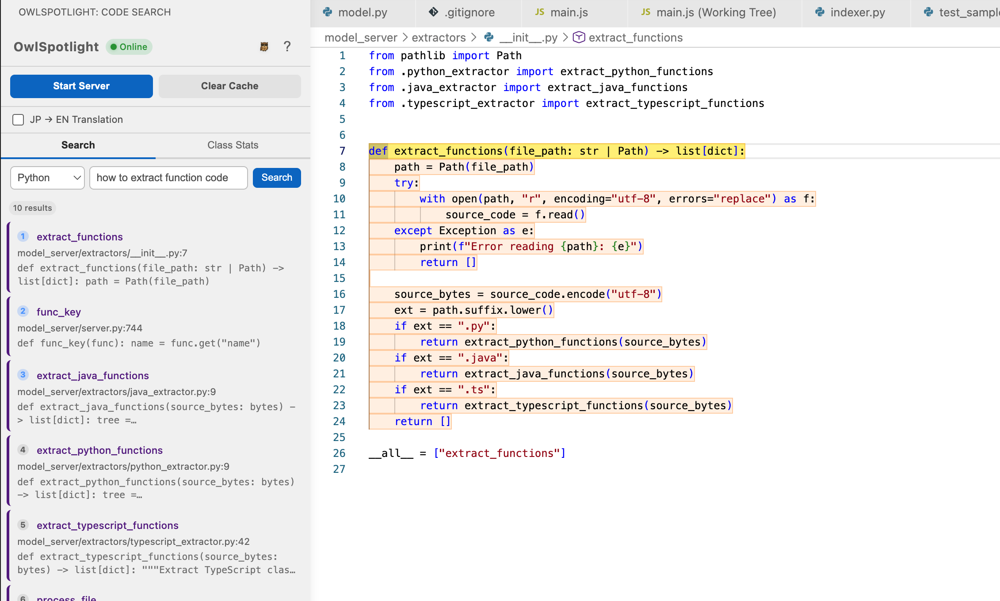
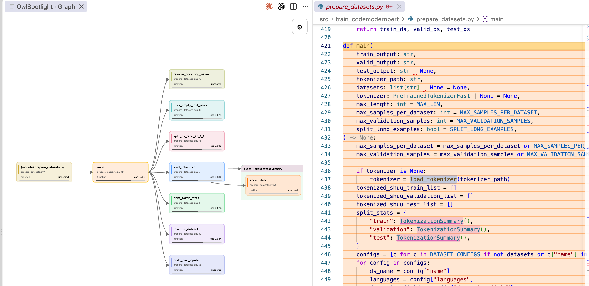
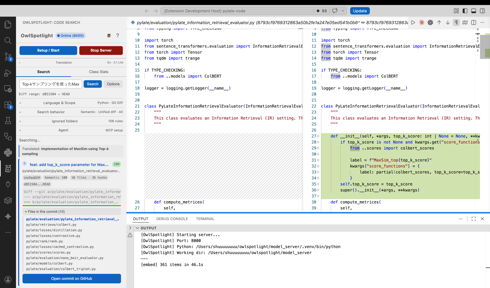

# OwlSpotlight

<div align="center">

[](https://opensource.org/licenses/MIT)
[](https://github.com/Shun0212/owlspotlight)
[](https://www.python.org/)
[](https://code.visualstudio.com/)
[](https://marketplace.visualstudio.com/items?itemName=Shun0212.owlspotlight)

**Local-first semantic code search for VS Code — optimized for Python structure and natural-language queries in English and Japanese.**

**Codex-ready MCP integration:** register OwlSpotlight from the sidebar and call `owlspotlight.search_code` directly from Codex.

Find functions, methods, classes, Python CodeBlocks, routes, tests, and call-heavy logic by describing intent — no need to remember names.

[English](#english) | [日本語](#japanese)

</div>

<div align="center">

### See it in action


*Describe what code does in English or Japanese — OwlSpotlight jumps straight to the highlighted definition.*

▶ More clips (startup · search · Git Diff search): **[DEMO.md](DEMO.md)**

</div>

---

<a name="english"></a>
## English

### Why OwlSpotlight?

OwlSpotlight lets you search your codebase by **describing what the code does** — no need to remember names or guess keywords. Type a natural-language query (in English or Japanese) into the VS Code sidebar, and OwlSpotlight finds the matching functions, methods, classes, top-level code blocks, FastAPI routes, and tests, then jumps straight to the definition and highlights it. You can also select a block of code in the editor and search for similar code, limit the search to files you've changed in git, and switch between hybrid, semantic, BM25, and literal keyword modes.

Indexing and retrieval run locally. Optional Gemini features send queries and inspected code to Google. MCP returns code to your connected agent and its provider; it does not invoke Gemini.

Under the hood, OwlSpotlight is more than generic chunk search. Its retrieval engine is **NightOwl-CodeEmbedding**, a ~150M-parameter code-embedding model I built myself: a bi-encoder on the ModernBERT architecture, fine-tuned for code retrieval from NightOwl, a base model I trained from scratch. OwlSpotlight builds a local semantic index from your code's structure, then combines the model's dense retrieval with BM25 lexical ranking and literal keyword matching.

| What you need | OwlSpotlight gives you |
|---|---|
| "Where is the FastAPI route that loads users?" | Route-aware Python metadata and hybrid search |
| "Find code like this selected block" | Editor selection search with direct jump |
| "Only search files I changed" | Git changed/untracked-file scope |
| "Search outside functions too" | Python `CodeBlock` extraction for top-level logic |
| "Use this from Codex" | Codex-ready MCP bridge with `owlspotlight.search_code` |
| "Search locally" | Search inside VS Code or through a local Python backend |



### Code Graph

Explore callers and callees alongside the source code. Function and method results open the graph on the left and the source editor on the right by default.



*Follow calls from `main` in the graph, then inspect the corresponding definitions and call sites in the source editor.*

- **Navigate in both directions:** click a node to open its definition; moving the cursor or switching tabs in the right editor selects the corresponding node. Click a call arrow to jump to its call site; multiple sites offer a location picker.
- **Read names in full:** cards grow to fit long names. Methods stay inside their class frame and move together when dragged. Classes with the same name in different files have separate frames.
- **Connect the graph to code:** call names are highlighted with their target node's color. Source definitions use the usual function, method, and class highlights, with the selected definition line in yellow.
- **Explore the neighborhood:** drag the background to pan and use the wheel to zoom. Selecting a node centers it at 83% zoom. Open **⚙** for **Fit**, **Expand selected**, **Reset**, and similarity controls.
- **Compare similar code:** **Show similar functions** adds up to five embedding neighbors with dotted lines. Cosine similarity appears as a number and bar; it is not a probability. Run a semantic search after edits if current embeddings are unavailable.
- **Understand the arrows:** dashed calls are static call estimates; solid calls come from VS Code Call Hierarchy. Calls across files are included when the installed language extension can resolve them within the selected directory. External-directory calls are omitted, and unresolved calls may be missing. The graph is not a complete runtime dependency map.

Toggle **Settings → Show dependency graph** in OwlSpotlight for code-only navigation, or use **Open dependency graph** to open it explicitly. Toggle editor synchronization under **⚙ → Settings → Sync graph and source code**. The graph explores beyond result filters, displays at most 80 nodes, and does not graph historical diff hunks. Provider-only nodes stay unscored until indexed and expanded.

### Highlights

- **Search modes**: `hybrid`, `semantic`, `bm25`, or literal `keyword` mode.
- **Python static analysis (Python backend)**: params, return annotations, decorators, imports, calls, assigned names, docstrings, local call graph, and import dependencies.
- **Python CodeBlocks (Python backend)**: searches top-level logic outside functions and classes, grouped by the regions between function/class definitions.
- **Framework-aware metadata (Python backend)**: FastAPI route and pytest symbol hints.
- **Search scopes**: all files, auto-detected source folders, or a `Git Diff` scope where you pick base/head commits from a built-in commit graph and search either the changed functions or the unified diff hunks.
- **Selection search**: right-click selected code and run `OwlSpotlight: Find Similar to Selection`.
- **Index updates**: the Python backend watches for file changes; simple mode refreshes saved files on each search.
- **Codex MCP support**: register OwlSpotlight from the sidebar to search and read code from Codex. The Python backend also provides repository grep and Agent Activity.
- **Claude Code**: support is coming in the next few days.
- **Japanese queries**: optional Japanese-to-English query translation via the Gemini API.

#### Execution modes

At setup, choose the execution mode that suits your environment:

- **backend_server(python)** starts a local Python search server and supports GPU acceleration on compatible systems. Install [`uv`](https://docs.astral.sh/uv/getting-started/installation/) first; OwlSpotlight handles the Python environment setup.
- **node_onnx** runs on the CPU inside VS Code without a Python server. Use it if server setup is unavailable or you prefer a simpler setup. The model downloads on the first semantic search.

The choice is saved. To change it, search for `owlspotlight.searchBackend` in **VS Code Settings** (default: `ask`). Python setup offers GPU auto-detection to select a compatible PyTorch/CUDA build for your GPU and driver. If the backend still will not run, try `node_onnx`; setup and startup failures switch to it automatically.

### Supported Languages

| Language | Support |
|---|---|
| Python | Functions and methods in both modes; CodeBlocks, AST metadata, and FastAPI/pytest hints with the Python backend |
| Java | Functions/methods/classes via Tree-sitter |
| TypeScript / TSX | Functions and class methods via Tree-sitter |
| JavaScript / JSX | Functions and class methods via Tree-sitter |

### Quick Start

1. Install OwlSpotlight from the [VS Code Marketplace](https://marketplace.visualstudio.com/items?itemName=Shun0212.owlspotlight).
2. Open a project and the OwlSpotlight sidebar.
3. Click **Choose search mode** and select **backend_server(python)** or **node_onnx**. Starting a search also opens this choice if no mode has been saved.
4. Complete setup, then describe the code you want to find.

Logs appear under **View → Output → OwlSpotlight**. The Python server runs in the background without occupying your terminal.

### Search Options

Open **Settings** in the sidebar to adjust search options:

| Option | Values |
|---|---|
| Language | Python, Java, TypeScript, TSX, JavaScript, JSX |
| Scope | `All`, `Source`, `Git Diff` |
| Mode | `Hybrid`, `Semantic`, `BM25`, `Keyword` |
| Type | `All`, `Functions`, `Methods`, `CodeBlocks` (Python backend only) |

`Source` auto-detects folders such as `src`, `app`, `lib`, `packages`, `client`, `server`, `backend`, and `frontend`.

The Python mode defaults to `Git Diff` and automatically loads the current branch's complete first-parent history, including its initial commit. Simple mode starts with `All`. Saved scope and range selections are preserved. Merge commits remain (compared with their first parent), while individual commits from merged side branches are excluded.

In **Settings → Search behavior**, choose **Range** (`Current branch: first → latest`, `Custom: From → To`, or `HEAD → working tree`) and **History** (`First parent only` or `Include merged branch history`). Custom ranges exclude From and include To. The tree remains visible outside Settings: From is blue, To is yellow, and selected commits and edges are green. Click a commit to set From; Shift+Click sets To and switches to a custom range. The tree shows up to 1,000 recent commits; the search includes the full selected history.

Choose a **Diff view**:

- `Functions` — only the functions changed in the selected diff.
- `Unified diff` — the changed lines, shown as unified diff hunks.

#### Code Diff Search

Use `Git Diff` when you want to review a working-tree change, a branch comparison, or a PR-sized patch by intent, instead of reading a raw diff from top to bottom. OwlSpotlight builds the search corpus from the selected diff range only, so queries like "where was the new retry logic added?" or "why did the MaxSim aggregation change?" surface the changed code that matches your intent.

- Choose `HEAD → working tree` for local changes, `Current branch: first → latest` for branch history, or `Custom: From → To` for a specific comparison.
- `Functions` maps changed line ranges back to the function-level code units they belong to, then searches those units.
- `Unified diff` searches the actual patch hunks — added, removed, and context lines — and results can open in VS Code's native side-by-side diff editor.
- All the usual ranking modes apply: use `Hybrid` / `Semantic` for intent-based review, `BM25` for lexical terms, and `Keyword` for exact identifiers.

Agents can use the same feature through `owlspotlight.search_code`: set `search_target` to `changed_functions` or `diff_hunks`, with `diff_range_mode="branch"` and `first_parent=true` for the sidebar defaults. Use `diff_range_mode="custom"` with `diff_base_ref` / `diff_head_ref` for a specific range, or `"working_tree"` for local changes. API calls that omit these settings use legacy range selection and all-parent traversal.



*Code Diff search keeps the query, the changed hunks, and VS Code's side-by-side diff view in a single workflow.*

### Python Static Analysis

With the Python backend, OwlSpotlight uses `ast` first and falls back to Tree-sitter when AST parsing fails — for example, while a file is temporarily broken mid-edit.

Extracted metadata includes:

- `params`
- `returns`
- `decorators`
- `imports`
- `calls`
- `assigned_names`
- `docstring`
- `framework_tags`
- `routes`
- `local_calls`
- `external_import_calls`
- `call_graph`
- `import_dependency`

CodeBlocks represent top-level code that lives outside functions and classes. They are grouped by the regions between function/class definitions rather than split aggressively at blank lines.

### MCP Integration

Use **Agent Setup → Create/update project Codex configuration** in the sidebar to connect your agent. The generated launcher uses your selected search mode. With **node_onnx**, it runs a Node.js stdio process with `owlspotlight.search_code` and `owlspotlight.read_code`; no Python or HTTP backend is needed. Restart the connected agent after changing modes.

The manual setup and additional tools below apply to **backend_server(python)**. Start the OwlSpotlight Python backend, then run the MCP stdio bridge:

```bash
python model_server/mcp_server.py
```

Example `.mcp.json` for Cursor and other MCP clients:

```json
{
  "mcpServers": {
    "owlspotlight": {
      "type": "stdio",
      "command": "python",
      "args": ["/absolute/path/to/owlspotlight/model_server/mcp_server.py"],
      "env": {
        "OWLSPOTLIGHT_SERVER_URL": "http://127.0.0.1:8000",
        "OWLSPOTLIGHT_WORKSPACE": "/absolute/path/to/your/workspace"
      }
    }
  }
}
```

The MCP tool is `owlspotlight.search_code`. If `OWLSPOTLIGHT_WORKSPACE` is set, you can call it with just a `query`. It also accepts the optional arguments `directory`, `file_ext` (defaults to `auto`, which respects `.owlignore` and git ignore/exclude rules), `top_k` (default `30`), `scope`, `search_mode` (default `semantic`), `search_target` (`functions`, `changed_functions`, or `diff_hunks`), `diff_base_ref`, `diff_head_ref`, `force_diff_refresh`, and `server_url`.

Agent searches are mirrored in the OwlSpotlight sidebar as compact activity entries. Use `owlspotlight.search_code` for semantic discovery, `owlspotlight.grep_repo` for exact, repository-wide reference checks, `owlspotlight.cancel_embedding` to stop a running indexing/embedding job, and `owlspotlight.mark_results_used` to record which ranks or grep hits the agent actually used as evidence. Human feedback is optional: the companion tool `owlspotlight.get_human_feedback` only comes into play when you explicitly enter query-improvement suggestions in the sidebar.

Use **Agent Setup → Create/update project Codex configuration** after starting the server. This writes `.codex/config.toml`, preserves other configuration values, and saves the previous file as `config.toml.owlspotlight.bak`. Restart Codex in this trusted project and check `/mcp`. Existing global registrations are left intact; project setup does not delete and re-add them. The remove option removes only the project entry. If you previously registered globally, `codex mcp remove owlspotlight` removes that older global entry separately.

The generated setup uses a stable launcher whose runtime path and server URL are refreshed by VS Code. Search HTTP timeout is 1,800 seconds; Codex tool timeout is 1,860 seconds, with progress notifications when the client supplies a progress token. Timeouts are ceilings, not target response times. A cancelled request does not trigger an empty-result retry. Reopen the workspace in VS Code after an extension update to refresh its runtime. See [OpenAI Docs: MCP configuration](https://learn.chatgpt.com/docs/extend/mcp?surface=cli).

Other clients can use the generated `.mcp.json`; Codex uses `.codex/config.toml`. The copied Codex command starts one session with equivalent settings (use PowerShell on Windows).

MCP search defaults to all files and function search; the sidebar remembers its selected scope. Both use branch history / first parent by default when searching history. Set `scope`, `search_target`, `diff_range_mode`, `first_parent`, and From/To explicitly to reproduce a sidebar query. Resolved arguments and the directory are included in MCP results. Agent Activity shows only the current workspace; **Show** restores the event's search conditions.

To create an agent card, call `owlspotlight.read_code` with `event_id` and `result_id` (the result rank as a string), then `owlspotlight.publish_result_annotations` with `title`, `reason`, and `highlights`. Follow `page.nextLine` as `start_line` to read more. Cards reuse Gemini's source snapshot, pagination and highlight validator. They accept only read lines, up to four highlights of twenty lines each, in blue/green/amber/purple. They need no Gemini key. The sidebar's Agent Activity → **Show** displays the cards. With JP → EN enabled, tool responses ask the agent to write explanations in Japanese.

`owlspotlight.cancel_embedding` requires an `operation_id` from progress. MCP cancellation notifications target only their active request; stale notifications cannot cancel another task.

### Build From Source

```bash
git clone https://github.com/Shun0212/owlspotlight.git
cd owlspotlight
npm install
npm run compile
npx vsce package
```

Then install the generated `.vsix` with `Extensions: Install from VSIX...`.

Run `npm run test:unit` for unit tests and `npm run test:onnx` for a CPU inference smoke test. The ONNX test downloads a model into the system temporary directory; set `OWL_ONNX_SMOKE_OFFLINE=1` to reuse a cached copy without downloads.

### Architecture

```text
VS Code sidebar
  ├─ backend_server(python)
  │    └─ Local HTTP → Python / FastAPI server
  │         ├─ Python AST and Tree-sitter analysis
  │         └─ Embeddings, FAISS, BM25, and keyword search
  └─ node_onnx
       └─ Node.js worker inside the extension
            ├─ Tree-sitter function and method extraction
            └─ ONNX CPU inference, BM25, and keyword search
```

### Commands

| Command | Description |
|---|---|
| `OwlSpotlight: Setup Python Environment` | Create or update the uv-managed Python environment |
| `OwlSpotlight: Start Server` | Start the background search server |
| `OwlSpotlight: Stop Server` | Stop the server |
| `OwlSpotlight: Code Search` | Open the sidebar search panel |
| `OwlSpotlight: Find Similar to Selection` | Search for code similar to the selected editor text |
| `OwlSpotlight: Clear Cache` | Clear the search index or simple-mode embeddings |
| `OwlSpotlight: Open Search Backend Settings` | Open the extension setting for choosing a search mode |
| `OwlSpotlight: Remove Virtual Environment` | Delete `.venv` and start fresh |

### Configuration

Open VS Code Settings and search for `owlspotlight` to find these options. The ONNX settings apply to `node_onnx`, which defaults to NightOwl 35M with INT8 precision (about 35 MB). Models are downloaded once and cached; BM25 and keyword search do not need a model.

| Setting | Default | Description |
|---|---:|---|
| `owlspotlight.searchBackend` | `ask` | Choose on first setup; `python` displays as backend_server(python), `node-onnx` as node_onnx |
| `owlspotlight.onnxModel` | `Shuu12121/NightOwl-CodeEmbedding-35M` | Simple-mode embedding model |
| `owlspotlight.onnxDtype` | `q8` | Simple-mode precision: INT8 or FP32 |
| `owlspotlight.onnxLocalFilesOnly` | `false` | Use cached models only |
| `owlspotlight.modelName` | `Shuu12121/NightOwl-CodeEmbedding` | Hugging Face embedding model |
| `owlspotlight.batchSize` | `2` | Embedding batch size |
| `owlspotlight.autoStartServer` | `false` | Start the server when VS Code opens |
| `owlspotlight.autoIndexOnFileChange` | `true` | Refresh the incremental index when supported files change |
| `owlspotlight.enableJapaneseTranslation` | `false` | Enable Japanese-to-English query translation |
| `owlspotlight.geminiApiKey` | `""` | Legacy setting; migrated to SecretStorage. Use Gemini Search → API key & data sharing. |
| `owlspotlight.cacheSettings.autoClearCache` | `false` | Clear the index cache on server start |
| `owlspotlight.environmentSettings.pythonVersion` | `3.11` | Python version used by `uv` |

### Troubleshooting

| Problem | Fix |
|---|---|
| Python server fails to start | Check **Output → OwlSpotlight** for the cause. Search falls back to simple mode; select the Python backend again in extension settings after fixing the environment. |
| `uv` not found | Install uv to use the Python backend, or use simple mode without it. |
| No results | Check the server status, language option, scope option, and whether files with that extension exist |
| Git Diff returns nothing | Check that the workspace is a Git repository and the selected range contains changes in the selected language. |
| Memory issues | For Python, lower `owlspotlight.batchSize` to `1`. For simple mode, use NightOwl 35M with INT8 precision. |
| Python file has syntax errors | OwlSpotlight falls back to Tree-sitter, so function/method search stays available |

### Contact

For questions, bug reports, feedback, or collaboration, reach out at [owlspotlight@gmail.com](mailto:owlspotlight@gmail.com).

### Roadmap

- Python framework extractors beyond FastAPI/pytest: Django views, SQLAlchemy models, Pydantic schemas.
- Import dependency explorer.
- Search history and bookmarks.
- Benchmarks on real repositories.

---

<a name="japanese"></a>
## 日本語

<div align="center">

**VS Code 向けのローカル完結型セマンティックコード検索**

</div>

### OwlSpotlight とは

OwlSpotlight は、関数やクラスの名前を覚えていなくても「**そのコードが何をするものか**」を説明するだけで目的のコードを見つけられる VS Code 拡張機能です。サイドバーから自然言語(日本語・英語)で入力すると、該当する関数・メソッド・クラス・トップレベルのコードブロック・FastAPI のルート・テストを見つけ出し、その場所へジャンプして定義をハイライト表示します。エディタで選択したコードに似たコードを探したり、検索範囲を Git の変更ファイルだけに絞り込んだり、Hybrid / Semantic / BM25 / 完全一致キーワードの各モードを切り替えたりすることもできます。

検索とインデックス作成はローカルで実行します。任意のGemini機能を使う場合はクエリや取得したコードがGoogleへ送信されます。MCPで返したコードは接続先エージェントとそのAIサービスに共有されます。MCP自体はGeminiを呼び出しません。

内部の仕組みも、単なるチャンク検索ではありません。検索エンジンには、私が独自に開発したコード埋め込みモデル **NightOwl-CodeEmbedding**(約 150M パラメータ、ModernBERT アーキテクチャの Bi-Encoder。ゼロから学習させた自作のベースモデル「NightOwl」をコード検索向けにファインチューニングしたもの)を採用しています。Python の構造・呼び出し・import・FastAPI のルート・pytest といった静的解析メタデータに、このモデルによる密ベクトル検索(dense retrieval)・BM25・完全一致キーワード検索を組み合わせて検索します。

**Codex MCP 対応**: サイドバーから OwlSpotlight を Codex に登録すれば、Codex 内で `owlspotlight.search_code` を直接呼び出せます。

### コードグラフ

呼び出し元・呼び出し先を、ソースコードと並べて確認できます。関数・メソッドの検索結果をクリックすると、既定で左にグラフ、右にコードを表示します。


*左側で `main` の呼び出し関係をたどり、右側で定義と実際の呼び出し箇所を確認できます。*

- **グラフとコードを双方向に移動**：ノードをクリックすると定義を開き、右側のカーソル移動やタブ切り替えでも対応するノードを選択します。矢印をクリックすると呼び出し箇所へ移動し、複数ある場合は移動先を選べます。
- **長い名前とクラス構造を表示**：名前の長さに合わせてカード幅を自動調整します。メソッドはクラス枠内に整列し、ドラッグ時も一緒に移動します。別ファイルの同名クラスは別の枠になります。
- **色で呼び出し先を確認**：コード内の呼び出し名には、呼び出し先ノードと同じ色を付けます。定義には通常の関数・メソッド・クラスのハイライトを使い、選択中の定義行は黄色で示します。
- **周辺を展開**：背景ドラッグで移動、ホイールで拡大縮小できます。ノード選択時は83%で中央に表示します。右上の **⚙** に **Fit**、**Expand selected**、**Reset**、類似度の操作をまとめています。
- **類似コードを比較**：**Show similar functions** で最大5件の類似ノードを点線で追加します。コサイン類似度は数値とバーで表示し、確率ではありません。編集後に類似度を取得できない場合は、セマンティック検索を実行してください。
- **矢印の意味**：破線は静的解析による推定、実線はVS CodeのCall Hierarchyによる呼び出しです。別ファイルへの呼び出しも、選択ディレクトリ内で言語拡張が解決できれば表示します。範囲外の呼び出しは除外し、解決できない呼び出しは表示されない場合があります。実行時の依存関係をすべて網羅するものではありません。

OwlSpotlightの **Settings → 依存グラフを表示** で自動表示を切り替え、**Open dependency graph** から明示的に開けます。コードとの連動は **⚙ → Settings → Sync graph and source code** で切り替えます。グラフは検索結果のフィルターを越えて探索し、最大80ノードを表示します。履歴の差分hunkは対象外です。言語機能だけで追加したノードは、索引に登録して展開するまでスコアが付かない場合があります。


### Agentic search

Settings → **Gemini Search** → **Agentic search** を有効にすると、OwlDiffSearch と同じく Gemini が検索結果を確認し、クエリの修正とキーワード検索による確認を繰り返します。検索範囲・言語・差分の From/To は、検索開始時の指定を維持します。

- APIキーはVS Code SecretStorageへ保存し、従来の設定値は保存成功後に移行・削除します。グローバル／ワークスペース／フォルダーの設定優先順位を維持します。クエリ、コードの抜粋、追加取得したソースがGeminiへ送信されます。
- `owlspotlight.agenticMaxSearches` は既定で 3 回、最大 6 回です。
- **Agent search** を開くと検索クエリ・件数・終了理由を確認できます。結果には関連度の推定と短い説明を表示します。関連度は確率ではありません。
- **■ Stop**、コマンドパレット、ステータスバーの停止は共通処理です。Geminiの翻訳・エージェントリクエストを中断し、後続検索を停止します。サーバーの埋め込み処理中は現在のバッチの完了を待ちます。
- API キー未設定や Gemini エラー時は、元のクエリによる通常検索、または取得済みの結果を表示し、理由を Agent search に示します。
- Gemini の既定モデルは **3.8 Flash**、軽量モデルは **3.5 Flash-Lite** です。3.5 Flash を明示的に選択している場合、その選択は維持されます。旧3.1モデルの設定は3.8 Flashとして扱います。


Geminiを有効にすると、外部送信の説明とAPIキーの設定画面が開きます。**APIキーを取得**からGoogle AI Studioへ移動し、作成したキーを貼り付けて保存できます。既存キーは画面へ返さず、設定済みかどうかだけを表示します。この画面は **Gemini Search → API key & data sharing** から再度開けます。翻訳モード（JP → EN）がオンの場合、案内とエージェントの説明は日本語になります。関連度は既存のスコアバッジ・バーのスタイルで表示します。


エージェントは必要に応じて `read_code` で検索結果のファイル全体を追加取得できます。通常のファイルは取得時点の内容、コミットの結果はそのコミット時点の内容を読み、削除されたファイルは親コミットの内容と明記します。検索結果に含まれるファイルだけを対象にし、長いファイルは最大200行・20,000文字ずつ、1検索あたり最大6回読みます（1ファイル1MiBまで）。取得範囲と行数はカードに表示します。

AIはカードの見出し、注目する行、青・緑・黄・紫の色、短い説明を指定できます。ハイライトは取得済みの実コードに限り、最大4箇所・各20行です。見出しをクリックするとカード内の「取得したコード」を展開し、該当行を表示します。追加取得したコードもGemini APIへ送信されることを利用案内に表示します。

### 主な機能

- **検索モード**: `Hybrid` / `Semantic` / `BM25` / `Keyword` を切り替え可能。
- **Python の静的解析（Python版）**: params、return annotation、decorator、import、call、代入名、docstring、call graph、import dependency を抽出。
- **Python の CodeBlock 検索（Python版）**: 関数やクラスの外にあるトップレベルの処理も検索対象に含めます。
- **FastAPI / pytest のヒント（Python版）**: ルートや test / fixture をメタデータとして保持。
- **検索スコープ**: 全体、source 系フォルダ、Git の変更済み・未追跡ファイル、またはブランチ比較から作った diff hunk から選択可能。
- **選択範囲からの類似検索**: エディタでコードを選択すると、似たコードへジャンプできます。
- **変更の反映**: Python版はファイル変更時に索引を更新し、簡易版は検索時に保存済みファイルを読み直します。
- **Codex MCP 対応**: サイドバーから登録し、Codexからコードを検索・取得できます。Python版ではリポジトリ内のgrepやAgent Activityも利用できます。
- **Claude Code**: 数日中に対応予定。
- **ローカルで検索**: 拡張機能内、またはローカルのPythonバックエンドで検索を実行します。
- **日本語クエリ対応**: Gemini API を設定すると、日本語のクエリを英語へ翻訳して検索します。

#### 実行方式

セットアップ時に、環境に合わせて実行方式を選びます。

- **backend_server(python)**：ローカルのPython検索サーバーを起動します。対応環境ではGPUを利用できます。先に [`uv`](https://docs.astral.sh/uv/getting-started/installation/) をインストールすると、Python環境の構築はOwlSpotlightが行います。
- **node_onnx**：Pythonサーバーを使わず、VS Code内でCPU実行する簡易版です。サーバーを構築できない場合や、手軽に使いたい場合に選んでください。モデルは初回の意味検索時にダウンロードします。

選択は保存されます。変更するには **VS Codeの設定で `owlspotlight.searchBackend` を検索**してください（初期値は `ask`）。Pythonのセットアップでは、GPUやドライバーに合うPyTorch/CUDAを自動判定し、手動設定を減らしています。それでも実行できない場合は `node_onnx` も試してみてください。環境構築・起動に失敗した場合は自動的に切り替わります。

### クイックスタート

1. [VS Code Marketplace](https://marketplace.visualstudio.com/items?itemName=Shun0212.owlspotlight) からインストールします。
2. プロジェクトとOwlSpotlightのサイドバーを開きます。
3. **Choose search mode** をクリックし、**backend_server(python)** または **node_onnx** を選びます。未設定のまま検索を始めた場合も、選択画面が開きます。
4. セットアップが終わったら、探したいコードの内容を自然言語で入力します。

ログは **表示 → 出力 → OwlSpotlight** で確認できます。Pythonサーバーはバックグラウンドで動作し、ターミナルを占有しません。

### 検索オプション

サイドバーの **Settings** から検索条件を変更できます。

| Option | 内容 |
|---|---|
| Language | Python, Java, TypeScript, TSX, JavaScript, JSX |
| Scope | `All`, `Source`, `Git Diff` |
| Mode | `Hybrid`, `Semantic`, `BM25`, `Keyword` |
| Type | `All`, `Functions`, `Methods`, `CodeBlocks`（Python版のみ） |

`Source` は `src`, `app`, `lib`, `packages`, `client`, `server`, `backend`, `frontend` などのフォルダを自動的に検出します。

`Git Diff` は検索対象をGitの差分に限定します。Python版の初期範囲は `Git Diff`、簡易版は `All` で、保存済みの選択があればそれを使います。

**Settings → Search behavior** の **Range** で、現在のブランチ全体、指定したFrom/To間、作業ツリーの変更を選べます。現在のブランチでは、既定で最初のコミットから最新までのfirst-parent履歴を検索します。コミットグラフではクリックでFrom、Shift+クリックでToを設定できます。続いて **Diff view** を選択します。

- `Functions` — 選択した差分で変更された関数のみ。
- `Unified diff` — 変更行を unified diff の hunk として表示。

#### コード差分検索

`Git Diff` は、作業ツリーの変更、ブランチ比較、PR サイズのパッチを、生の diff を上から順に読む代わりに「どんな意図の変更か」でレビューしたいときに使います。選択した diff 範囲だけを検索対象にするため、`リトライ処理を追加した箇所` や `MaxSim の集計を変えた差分` のようなクエリで、意図に合う変更済みコードだけを順位付けできます。

- 作業中の変更は `HEAD → working tree`、ブランチの履歴は `Current branch: first → latest`、特定の範囲は `Custom: From → To` を選びます。
- `Functions` は変更行を含む関数レベルのコード単位へ写像し、そのコード単位を検索します。
- `Unified diff` は追加行・削除行・前後の context を含む実際の patch hunk を検索し、結果から VS Code の左右 diff エディタを開けます。
- 通常の検索モードもそのまま使えます。意図ベースのレビューは `Hybrid` / `Semantic`、用語一致は `BM25`、識別子の完全一致は `Keyword` が向いています。

エージェントからも同じ機能を使えます。`owlspotlight.search_code` で `search_target` に `changed_functions` または `diff_hunks` を指定し、特定の比較をしたい場合は `diff_base_ref` / `diff_head_ref` を渡します。


*クエリ、差分 hunk の検索結果、VS Code の左右 diff 表示を同じ流れで確認できます。*

### MCP連携

サイドバーの **Agent Setup → Create/update project Codex configuration** から接続設定を作成できます。選択中の検索モードに合わせたランチャーが生成されます。**node_onnx** ではNode.jsのstdioプロセスを使い、PythonやHTTPバックエンドなしで `owlspotlight.search_code` と `owlspotlight.read_code` を利用できます。モードを変更したら、接続先のエージェントを再起動してください。

以下の手動設定と追加ツールの説明は **backend_server(python)** 向けです。先にOwlSpotlightのPythonバックエンドを起動し、続いてMCPのstdioブリッジを起動します。

```bash
python model_server/mcp_server.py
```

Cursor などの MCP クライアント向けの `.mcp.json` の例:

```json
{
  "mcpServers": {
    "owlspotlight": {
      "type": "stdio",
      "command": "python",
      "args": ["/absolute/path/to/owlspotlight/model_server/mcp_server.py"],
      "env": {
        "OWLSPOTLIGHT_SERVER_URL": "http://127.0.0.1:8000",
        "OWLSPOTLIGHT_WORKSPACE": "/absolute/path/to/your/workspace"
      }
    }
  }
}
```

MCP ツールは `owlspotlight.search_code` です。`OWLSPOTLIGHT_WORKSPACE` を設定していれば、`query` だけで呼び出せます。このほか、任意の引数として `directory`、`file_ext`(デフォルトは `auto` で、`.owlignore` と Git の ignore / exclude ルールに従います)、`top_k`(デフォルト `30`)、`scope`、`search_mode`(デフォルト `semantic`)、`search_target`(`functions`、`changed_functions`、`diff_hunks`)、`diff_base_ref`、`diff_head_ref`、`force_diff_refresh`、`server_url` も受け取ります。

エージェント経由の検索は、OwlSpotlight サイドバーにコンパクトなアクティビティとして表示されます。意味的な検索には `owlspotlight.search_code`、リポジトリ全体での厳密な参照確認には `owlspotlight.grep_repo`、実行中のインデックス作成・埋め込み処理の停止には `owlspotlight.cancel_embedding`、実際に根拠として使った順位や grep の該当箇所の記録には `owlspotlight.mark_results_used` を使います。人間によるフィードバックは任意です。サイドバーで改善案を明示的に入力した場合にのみ、追加の MCP ツール `owlspotlight.get_human_feedback` を通じてエージェントが取得できます。

サーバー起動後に **Agent Setup → Create/update project Codex configuration** を選ぶと、プロジェクトの `.codex/config.toml` を作成・更新します。他の設定値は維持し、更新前の内容を `config.toml.owlspotlight.bak` に保存します。Codexをこの信頼済みプロジェクトで再起動し、`/mcp` で確認してください。既存のグローバル登録は変更しません。削除メニューはプロジェクトの登録だけを削除します。古いグローバル登録を解除する場合は、別途 `codex mcp remove owlspotlight` を使います。

ランチャーはVS Codeの保存領域に置き、拡張機能のパスやサーバーURLを更新できるようにしています。拡張機能更新後はVS Codeで対象ワークスペースを開き直してください。HTTP検索の上限は1,800秒、Codexのツール待機上限は1,860秒です。対応クライアントには進捗を通知します。停止は「候補なし」と区別し、再検索を促しません。[OpenAI DocsのMCP設定](https://learn.chatgpt.com/docs/extend/mcp?surface=cli)に合わせています。

Codexは `.codex/config.toml`、他のMCPクライアントは生成した `.mcp.json` を使います。コピー用Codexコマンドは、そのセッションだけ同じ設定で起動します（WindowsではPowerShell用）。

MCPは既定で全ファイルの関数検索、サイドバーは選択中の範囲を使います。履歴検索の既定はどちらもbranch / first parentです。同じ対象を検索する場合は `scope`、`search_target`、`diff_range_mode`、`first_parent`、From/Toを明示してください。MCP結果には解決済み条件とディレクトリを返します。Agent Activityは現在のワークスペースだけを表示し、**Show**で検索条件も復元します。

Codexなどからカードを作る場合は、検索後に `owlspotlight.read_code` へ `event_id` と `result_id`（検索結果の順位を文字列で指定）を渡します。続きは `page.nextLine` を `start_line` に指定します。その後 `owlspotlight.publish_result_annotations` で `title`、`reason`、`highlights` を指定すると、Agent Activity → **Show**で説明と色付きコードが表示されます。コード取得・ページ分割・ハイライト検証はGeminiと共通です。取得済みの行だけを最大4箇所・各20行、青・緑・黄・紫で指定できます。Geminiキーは不要です。JP → ENがオンなら、ツール結果で説明を日本語にするようエージェントに指示します。

`owlspotlight.cancel_embedding` は進捗通知の `operation_id` が必須です。MCPのキャンセル通知は対応する実行中リクエストだけを対象とし、終了済みの通知で別の処理を停止しません。

### 連絡先

質問・不具合報告・フィードバック・共同開発などは、[owlspotlight@gmail.com](mailto:owlspotlight@gmail.com) までご連絡ください。

### 開発

```bash
npm install
npm run compile
npm run lint
npm test
python3 -m unittest model_server.tests.test_extractors
```

### License

MIT
