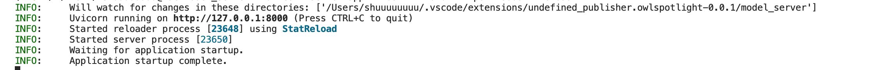
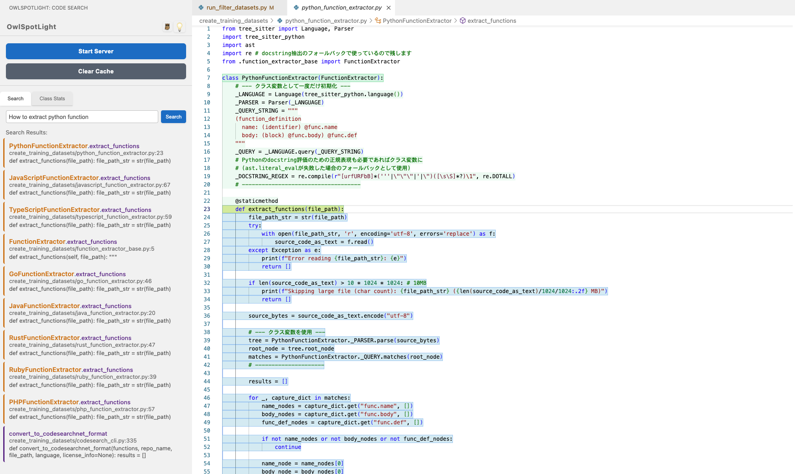

# 🦉 OwlSpotlight

**Instantly discover code with semantic search. A VS Code extension for searching Python functions, classes, and methods using natural language.**

**意味的検索でPython関数・クラス・メソッドを瞬時に発見できるVS Code拡張機能。**

---

## 📝 Prerequisites / 前提条件

- **Clone this repository locally.** OwlSpotlight works on your local codebase only. Remote repositories and online browsing are not supported.
- **このリポジトリをローカルにクローンしてください。OwlSpotlightはローカルのコードベースでのみ動作します。リモートリポジトリやオンライン利用は非対応です。**

---


> **All screenshots have been updated! See below for the latest UI and features.**
> **スクリーンショット画像を一新しました。最新のUIや機能は下記のデモ画像をご覧ください。**

## ✨ Key Features / 主な機能

- 🔍 **Natural language code search / 自然言語コード検索** – Find Python functions, classes, and methods with intuitive queries / 直感的なクエリでPythonの関数・クラス・メソッドを検索
- ⚡ **Instant jump / 即ジャンプ** – Jump directly to results in your editor / 検索結果から該当箇所に即座に移動
- 🎯 **Function, class & method support / 関数・クラス・メソッド対応** – Search both standalone functions and class methods, as well as class definitions / スタンドアロン関数、クラス定義、クラスメソッドすべてを検索
- 📊 **Class ranking view / クラスランキング表示** – See class relevance based on function/method scores / 関数・メソッドのスコアでクラスの関連度を可視化
- 🚀 **Fast incremental updates / 高速インクリメンタル更新** – Only changed files are re-indexed / 変更ファイルのみ再インデックス
- 🎨 **Intuitive UI / 直感的UI** – Simple sidebar interface / サイドバーから簡単操作
- 🧹 **Cache clear & environment management / キャッシュクリア・環境管理** – Clear cache and manage Python virtual environment directly from the sidebar / サイドバーからキャッシュクリアや仮想環境の管理が可能
- 🆕 **Class statistics & filtering / クラス統計・フィルタリング** – View class statistics and filter by classes or standalone functions / クラス統計表示や関数のみ・クラスのみの絞り込みが可能
- 🆕 **Automatic configuration sync / 自動設定同期** – Extension settings are automatically reflected in the Python server / 拡張機能の設定がPythonサーバーに自動反映
- 🆕 **Help modal & GitHub link / ヘルプモーダル・GitHubリンク** – Access help and repository directly from the sidebar / サイドバーからヘルプやGitHubリポジトリに直接アクセス

---

## 🚀 Quick Start

> **Note for Windows users:**
> Quick start (automatic setup) is not available on Windows. Please follow the manual setup instructions below.

### Automatic Setup (macOS/Linux recommended)

1. Open this project in VS Code
2. Run the following in the Command Palette (`Cmd+Shift+P` / `Ctrl+Shift+P`):
   ```
   OwlSpotlight: Setup Python Environment
   ```
3. Start the server:
   ```
   OwlSpotlight: Start Server
   ```
4. Start searching from the sidebar!



---

## 🎬 Demo (New Screenshots)

### 1. Function Detection & Semantic Search


- Automatically extracts Python functions in the project and discovers them instantly with semantic search.
- Functions are highlighted based on the search terms.

### 2. Method Detection within Classes



- Class definitions and their methods are also automatically extracted and included in the search.
- Enables search and ranking with class structure in mind.

### 3. Class Ranking View


- Ranks classes based on the relevance of their functions and methods.
- Easily see the number of functions per class and their scores.

### 4. Alert for Server Not Running


- Clear alerts are shown when the Python environment or server is not running.

---

## 💡 Why Choose OwlSpotlight

### 🎯 Semantic Search Accuracy
- **Natural language queries** – Search for functions, classes, and methods by intent and context
- **Code snippet search** – Search is also possible with actual code snippets
- **Comprehensive support** – Covers functions, classes, and class methods

### ⚡ Performance
- **Fast incremental updates** – Efficiently updates only the changed parts
- **Clustered index** – Fast search even in large projects
- **FAISS optimization** – Instant search even with tens of thousands of functions and classes

### 🛠 Developer Experience
- **Intuitive UI** – Easy operation from the sidebar
- **Instant highlights** – Immediate display of search results in the editor
- **.gitignore compliant** – Automatically excludes unnecessary files
- **Apple Silicon optimization** – Fast operation on M1/M2/M3/M4 chips

### 🔄 Smart Updates
- **Diff detection** – Automatically detects additions, changes, and deletions of files
- **Function-level management** – Precise index management at the function level
- **Real-time synchronization** – Instant response to code changes

---

## ⚠️ Notes

- **The search target is Python functions.** Class definitions are also used for navigation and ranking, but the essence of the search is function-based.
- **The initial index creation may take time.**
- **Only Python code is the search target. Variables and constants are excluded.**
- **Class ranking is based on the scores of functions and methods.**
- **OwlSpotlight is semantic search (context and meaning-based).**

---

## 🛠️ Installation Instructions (Manual Installation from VSIX File)

1. Run the following commands in this repository to create the VSIX file.
   ```sh
   npm install
   npm run compile
   npx vsce package
   ```
   The generated `owlspotlight-*.vsix` file is the extension package.

2. Open VS Code and select `Extensions: Install from VSIX...` from the Command Palette (`Cmd+Shift+P` or `Ctrl+Shift+P`).

3. Select the generated `.vsix` file and install it.

4. The "OwlSpotlight" icon will appear in the sidebar.

5. From the Command Palette, run:
   - `OwlSpotlight: Setup Python Environment`
   - `OwlSpotlight: Start Server`
   in order.

6. You can now use natural language to search code from the sidebar.

> **To uninstall:**
>
> Open the Extensions view, right-click "OwlSpotlight", and select "Uninstall".

---

## 🛠️ Installation (Manual VSIX Install)

1. In this repository, run the following commands to build the VSIX file:
   ```sh
   npm install
   npm run compile
   npx vsce package
   ```
   This will generate a file like `owlspotlight-*.vsix` (the extension package).

2. Open VS Code and open the Command Palette (`Cmd+Shift+P` or `Ctrl+Shift+P`).
   Select `Extensions: Install from VSIX...`.

3. Choose the generated `.vsix` file and install it.

4. The "OwlSpotlight" icon will appear in the sidebar.

5. From the Command Palette, run:
   - `OwlSpotlight: Setup Python Environment`
   - `OwlSpotlight: Start Server`
   in order.

6. You can now search code using natural language from the sidebar.

> **To uninstall:**
>
> Open the Extensions view, right-click "OwlSpotlight", and select "Uninstall".

---

## 🔧 Manual Setup

If automatic setup does not work (or on Windows):

1. Install required tools:
   ```zsh
   brew install npm
   brew install pyenv
   pyenv install 3.11
   ```
2. Set up the Python environment:
   ```zsh
   cd model_server
   pyenv local 3.11
   python3 -m venv .venv
   # On macOS/Linux:
   source .venv/bin/activate
   # On Windows (Command Prompt):
   .venv\Scripts\activate
   # On Windows (PowerShell):
   .venv\Scripts\Activate.ps1
   pip install -r requirements.txt
   cd ..
   ```
   > If you see an error with `source .venv/bin/activate`, make sure you are using a POSIX shell (like bash or zsh). On Windows, use the appropriate command above. If you still have trouble, check your Python installation and permissions.
3. Launch the extension in VS Code (F5) and click "Start Server" in the OwlSpotlight sidebar.
4. Search for functions, classes, or keywords from the sidebar.

---

## ⚙️ System Requirements & Environment

- **Python**: 3.9+ (3.11 recommended)
- **Memory**: 4GB+ (8GB+ for large projects)
- **Storage**: Several GB for virtualenv and dependencies
- **Apple Silicon (M1/M2/M3/M4)**: Fully supported
- **Windows/Linux**: Manual setup required; not fully tested
- **CUDA/GPU**: Not tested (support planned)

### Performance Tips
- More memory = better performance (Transformer model)
- Fast CPU/GPU = faster indexing/search
- SSD recommended for best search speed
- Always use Python 3.11 for the virtual environment
- Exclude unnecessary files (e.g. `.venv/`) in `.gitignore`
- Install `flash-attn` for CUDA environments if needed

---

## 🚧 Development Status & Roadmap

### Current Status
- ✅ Python function, class & method search
- ✅ Natural language & code fragment search
- ✅ Apple Silicon optimization
- ✅ Incremental indexing updates
- ✅ Class ranking view
- ✅ Function-only filtering

### Upcoming Features
- 🔄 CUDA/flash-attention support (GPU acceleration)
- 🔄 Multi-language support (JavaScript, TypeScript, Java, etc.)
- 🔄 Class inheritance visualization
- 🔄 VS Code Marketplace release
- 🔄 Real-time code change detection (auto-update on save)

### Limitations
- Python only (multi-language support planned)
- Only functions, classes, and class methods are indexed (variables/constants are not)
- CUDA environments untested (support planned)

---

## 📄 License

MIT License – See the `LICENSE` file for details.

---

**Notice:**
*This extension is under active development. Features and behaviors may change without notice.*

**Contributing:**
Bug reports and feature requests are welcome in Issues.

---